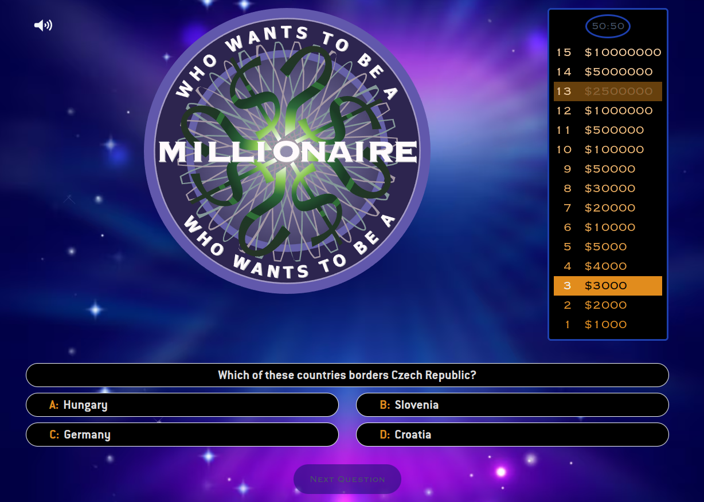

# Who Wants To Be A Millionaire Game

This is a Web game based on the famous TV game show that features a quiz competition with contestants attempting to win a top prize of $1,000,000 by answering a series of multiple-choice questions.

## Live Demo

<https://who-wants-to-be-millionare.vercel.app/>

## Tech Stack

Built with React + Vite.

React-Router for managing page routing

Tailwind for styling.

[react-use-audio-player](https://github.com/E-Kuerschner/useAudioPlayer) for sound effects managing

## Data Sources

[The Trivia Api](https://the-trivia-api.com) for the questions.

[VGMsite](https://vgmsite.com/soundtracks/who-wants-to-be-a-millionaire-the-album) for the sound effects.

[OnlineWebFonts](https://db.onlinewebfonts.com) for the fonts.

## To Run in development

Clone repository

In root directory:

$> npm install

$> npm run dev
